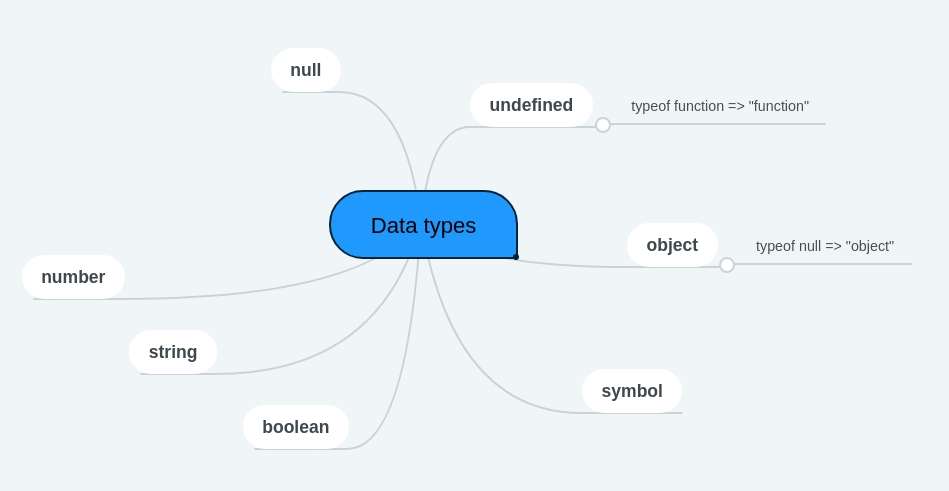

# Fundamentals

- `use strict` switches engine in a "modern mode". Several language features, like “classes” and “modules”, enable strict mode automatically. It's recommended to aloways start script with this line.
- `const` and `let` are modern keywords for variable declaration. `var` is old-school variant.
- no need in semicolon after function declaration (don't mess with function expression)
- There are 7 basic data types:

- Type conversions:

| value  | String(value) |
| ------------- | ------------- |
| false | "false"  |
|null  | "null"  |
> Occurs in output process

| value  | Number(value) |
| ------------- | ------------- |
| undefined | NaN  |
|null  | 0  |
|true / false | 1 / 0  |
|string  | Stripped string to number, otherwise NaN |
> Performed in math operations.

| value  | Boolean(value) |
| ------------- | ------------- |
| undefined, null, NaN | false  |
| 0  | false  |
| "" | false  |
| other values | true |
| "0" / " "  | true |
> Occurs in logical operations

- Operators:

```javascript
alert( 1 + '2' ); //  "12";
alert( +true ); // 1
a = b = c = 2 + 2; // Chained assignments
```
```javascript
let b = 1;
let a = b++; // a = 1, b = 2;
a = ++b; // a = 3, b = 3
```
- Comparison
	- String are compared in lexicographical order (unicode codes)
	- JS compares different types by converting them to numbers
	- `null == undefined` they equal each other, but not any other value
	- Be careful when using comparisons like > or < with variables that can occasionally be null/undefined. Checking for null/undefined separately is a good idea.

- Loops

```javascript
while(condition) { statements };

do { statements } while(condition);
```
`break; continue;` (doesn't work in ternary operator)
```javascript
for (let i = 5; i < 10; i++) { console.log(i) };
```
Labels
```javascript
outer: for(...) {
	for(...) {
		...
		break(outer);
	}
}
```
- Switch
	- checks by strict ===
	- `break` is a must (unless 'grouping' cases)

```javascript
switch(x) {
	case(value1):\
		...
		[break]
	case(valueX):
		...
		[break]
	default:
		...
		[break]
}
```
- Functions
	- default `return` value is `undefined`
	- values passed to a function as parameters are copied to its local variables.
	- function naming prefixes should be agreed among a project devs
  - a rule of thumb is to use function declaration (instead of expression) if you can use both
  - function declarations are initialized before script start

```javascript
function abc(a, b, c) {
	//body;
	[return ...]
}
```

```javascript
(a, b, c) => method(...) // returns result of right part
(a, b, c) => { body } // return result explicitly
```
